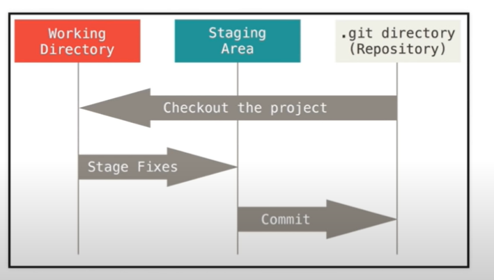
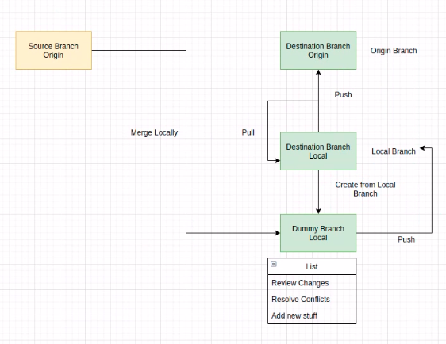

# Git Commands Guide



## **Steps** 

```shell
git clone <https git server repo url / ssh>       (Clones a repository from remote repo to your repo)
git branch -a
git checkout <branch name>
git pull
git add -A     ||     git add <filename>     ||     git add .
git commit -m "your comments"  || git commit -am "your comments"  (to stage it and commit)
git push
```

## **To remove unstaged things** 
```shell
git restore .     (for entire stuff)
git restore <filename>      (for specific files)
```



## **To create a merge request from cli**
### **NOTE: if you create a branch make sure to checkout to the branch you want to copy it from**
```shell
git checkout -b testingmerge      (create the branch and checkout to that branch)
git merge origin/pats-fx-oms-app-global   (merge from pats-fx-oms-app-global to testingmerge branch)
git checkout pats-fx-oms-app-global-qa
git merge testingmerge        (merge from testingmerge to pats-fx-oms-app-global-qa branch)
```

- git log --oneline     (to check the previous commits and the head)
