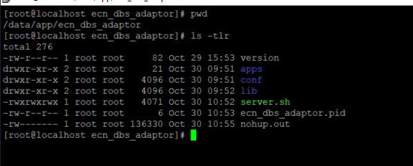

# Troubleshooting ECN

## Adapter Directory


> /data/app/

## To stop and start ECN service
```Shell
cd /data/app/ecn_dbs_adaptor/
./server.sh stop
./server.sh start
./server.sh check
./server.sh restart
```

## To check the status of each port
```Shell
netstat -an |grep <Port number>
netstat -an |grep 11290 11291 14025 14026
netstat -an |grep -i  established
```

## To restart web service on 200.32.1.16 just need to restart nginx service
```Shell
cd /usr/local/nginx
./restart.sh
```

## FIX logs checks
- 35=D (SCB new order)
- 35=AB (DBS new order)
- 35=8 (receive success)
> - grep -Rw adaptor.log -e '35=AB'     (to check the specific contents inside the file)

## To view streaming logs
```Shell
sudo tail -f /data/app/logs/ecn_scb_adaptor/adaptor.log
tail -f nohup.out
```

## To run the .jar file
```Shell
java -server –jar <jar file>
java -server -jar ms-pats-order-management-api.jar
```